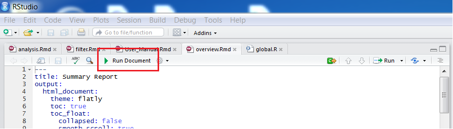
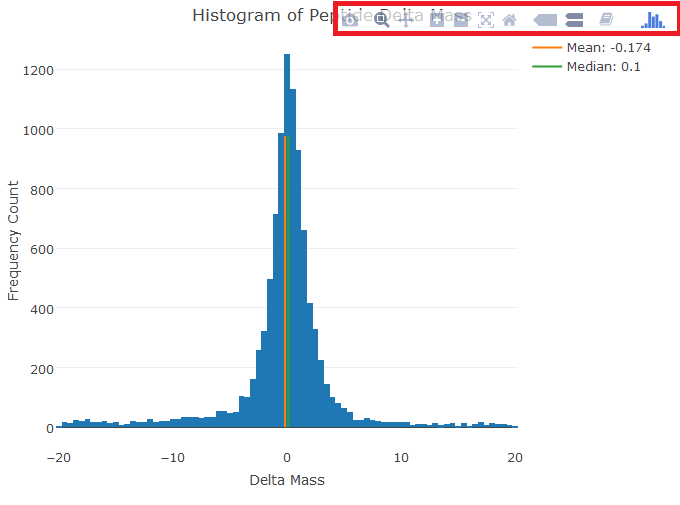

```{r setup, include=FALSE}
knitr::opts_chunk$set(echo = TRUE)
```

## Introduction
The automated summary report system provides a web-based summary report for proteomics data analysis. The system is built upon [Shiny](https://shiny.rstudio.com/), a web application framework for R, providing an interactive environment for users to scrutinize input data, perform primary analysis, and conduct protein groups association study. Unlike traditional analysis tools requiring a lot of script-writing, this system enables users to carry out the analyses under various conditions on input data via a user-friendly graphic interface and summarizes the results with interactive graphs.   
The report generated by the system consists of three sections: Overview, Filter, and Analysis. Overview section provides a general description of input data, which reveals the basic information of peptides, protein groups, and samples; filter section provides similar information as overview section but with user specified conditions  to select a subset of data qulified for further investigation; analysis section provides results of protein groups association study on selected data. Each section is presented in a web page and links to other sections through the hyperlinks located at the beginning.   
In following sections, we will introduce how to set up the system, how to prepare data for analysis, the functionalities of interactive graphs,  and the method used for protein groups association study.

## Installation
The system is composed of 3 Rmarkdown files and 1 R scripts. The 3 Rmarkdown files response for the graphic interface of different sections in the report, while the R script supplies data manipulation and analysis. To set up an environment for Rmarkdown files and R scripts, users need to install RStudio and R packages. Following sections provide instructions.

### R
Please install R. Please install a version later than R 2.11.1. Download and installation instruction can be found at [https://ftp.ussg.iu.edu/CRAN/](https://ftp.ussg.iu.edu/CRAN/).

### Rstudio
[RStudio](https://www.rstudio.com/products/RStudio/) provides an integrated development enviroment to view and modify Shiny application. Download and installation instruction can be found at [https://www.rstudio.com/products/rstudio/download3/](https://www.rstudio.com/products/rstudio/download3/).

### R Packages
Multiple R packages are required to support the interactive features of the report, such as [plotly](https://cran.r-project.org/web/packages/plotly/plotly.pdf), [shiny](https://cran.r-project.org/web/packages/shiny/shiny.pdf), [d3heatmap](https://cran.r-project.org/web/packages/d3heatmap/d3heatmap.pdf), [DT](https://cran.r-project.org/web/packages/DT/DT.pdf), [energy](https://cran.r-project.org/web/packages/energy/energy.pdf). To install packages required, please run following command in RStudio to install the packages needed.
```{r eval=FALSE}
install.packages(c("plotly","shiny","devtools","DT","energy","ggplot2"))
devtools::install_github("rstudio/d3heatmap")
```
### Scripts
Please created a new folder, and move "overview.Rmd","filter.Rmd","analysis.Rmd", and "global.R" to the folder. You can find the scripts in ShareSpace at [\\\\elnt118\\agrditda\\UIUC\\Guo, Boyi\\Proteomics Analysis Tool\\Codes](\\\\elnt118\\agrditda\\UIUC\\Guo, Boyi\\Proteomics Analysis Tool\\Codes\\).   

In addition. there are two R files for d3heatmap needed to be updated. After successfully installed the d3heatmap package you need to:

* d3heatmap: locage d3heatmap.js normally at   
"C:/Users/user_id/R/win-library/version_no./d3heatmap/htmlwidgets/".   
Replace the existing one with the one in Code folder
* heatmapcore: locage heatmapcore.js normally at

"C:/Users/user_id/R/win-library/version_no./d3heatmap/htmlwidgets/lib/d3heatmapcore".   
Replace the existing one with the one in Code folder


## Preparation
Before generating the interactive report, there are two more steps to follow, data preparation and system preparation.

### Data Preparation   
The system is an automated system. It will automatically locate samples and variables in the data file. But they require certain standards for the system to recognize. Here are requirements for the formats.

1. Save your data as CSV file. Leave the column names in the file
2. The file containing samples should be named as "idcompare_proteingroups.csv"; The file containing peptides should be named as "idcompare_peptide.csv"
3. Samples' names always start with "Spectrum_Count_"
4. Hit rates should be attached to the end of samples' names, starting with an underscore like "SampleName_040". No characters followed.
5. Please rename the samples short and concise if possible. This is to prepare for a better visualization effect for graphic outcomes in the report.   
Correct sample names:

* Spectrum_Count_sample1_080
* Spectrum_Count_WhatEverIsHere_100
* Spectrum_Count_Every thing is correct_12

Incorrect sample names:

* Spectrum_count_sample_080("Spectrum_Count_"is case sensitive)
* Spectrum_Count_sample_100_(No attachment after hit rate)
* Spectrum_Count_sample97(An underscore before hit rate)
* Spectrum_Count_sample_105(Invalid hit rate

There is also a automatic data validation process when generating reports. If there is any violation of these name formats, the system will prompt an error message in the console of RStudio.   
After modifying the formats as required, users need to move the data files to the same folder where the script files are.

### System Preparation
Users need to set the folder containing script files as the working directory in RStudio. It can be achieved by code
```{r eval=FALSE}
setwd("/Path/to/folder/")
```
or by clikcing "Session"->"Set Working Directory"->"Choose Directory" in the tool bar of RStudio interface.

## Report Generation
After previous preparation, the system is ready. There are two ways to start the system. It can be achieved by runing
```{r eval=FALSE}
rmarkdown::run("overview.Rmd")
```
or by clicking "Run Document" under the Rmarkdown files tab, as shown as the following graph.



After run the system, RStudio will take 1 minute to prepare the webpage for the sections. Please remain patient. The webpages will bring to the front once it finished. Meanwhile, please monitor the console window(R Markdown) for any error messages or warnings when generating the report.

## Functionalities
In the report, there are mainly two types of interactive components: inputs and graphs. The inputs are html widgets that help user to set conditions to subset data for further analysis. After users change the input, the report will automatically show the updated analysis with data qulified for conditions setted. The graphs are mainly constructed with _plotly_ package, which renders couple functions, such as changing display size, saving picture, etc. These functionaility will show at the upper right corner when users mouse move there. The effects shows as in Figure 2.



There are other effects for different types of graphs. In general there will be more information shown when the mouse clicks or hovers at certain area.

To be noted, the heatmaps at the end of filter section and analysis section are a little different than other interactive graphs, as they are built with _d3heatmap_ package. 

* To enelarge certain area, click and drag the mouse to select the area. When the clcik is released, the area will be enlarged.
* To Zoom out, single click
* To view the detail information of a certain cell, please double click the cell. Then the information will appear in the box above. When it is at the zoom-in mode, as you make the double click, the graph will bring back to the original scale also
* Heatmap can not be saved as other graphs. Users need to make print screen to save it.

## Association Analysis Method
In the system, a univariate screening method is developed to examine the association of protein groups and hit rate. Distance covariance is used to assess the independence between protein groups and hit rate. Unlike classic correlation, distance correlation is also sensitive to relationships other than the linear relationship.   
Due to the limited sample size, we are not able to build a model involving all the protein groups and generate an accurate result. We then focus on the effect of individual protein group. Univariate screening helps us achieve this by testing the independence between each protein group and the hit rate at the same time. However, there is one problem with univariate screening, multiple comparisons problem, as requiring the same level, it is likely to make more false discoveries when conducting a serial of tests simultaneously than conducting only one test at a time. We adjusted the p-values calculated from each test with Bonferroni correction and Benjamini-Hochberg correction to restrict family-wise error rate and false discovery rate respectively.   
To assess the independence between each protein group and the hit rate, we deploy distance covariance test. With the constraint on sample size, it is difficult to validate the distribution of protein group with confidence. Distance covariance test provides a method of evaluating the association without assumption on distribution. What's more, comparing to other non-parametric tests based on rank, distance covariance test is more sensitive for testing non-monotone types of dependence.

## Appendix
### Error Messages
#### Peptide Error Message
* "ERROR: Mandatory Varaibles Not Found. Please check variable names in peptide data file": It means that the "Peptide Sequence" column and ""Best Hit Delat Mass (ppm)" column are not found in the data file. Please include these two columns in the data file so that the further analysis can be performed. Make sure the variable name is exactly as provided here.

#### Protein Error Message
* "ERROR: Sample Not Found. Please check sample names": Sample name format in the data file is not as required. Please refer back to Data Preparation Section.
* "ERROR: Varaible Not Found. Please check protein file variable names": Necessary columns can not found in the data file. Necessary columns includes "Defline", "Confidence(1 - Local False Positive Rate)
","Occurrence","Total Spectrum Count".
* "ERROR: Hit Rate Not Fount. Please include hit rates in sample names": Can not find the Hit Rate in the sample name
* "ERROR: Invalid Hit Rate. Please check hit rates": Hit rate format in the data file is not as required. Please refer back to Data Preparation Section.


### Techinical Reference
* Shiny reference: [http://shiny.rstudio.com/reference/shiny/latest/](http://shiny.rstudio.com/reference/shiny/latest/)
* plotly reference: [https://plot.ly/r/reference/](https://plot.ly/r/reference/)
* d3heatmap GitHub: [https://github.com/rstudio/d3heatmap](https://github.com/rstudio/d3heatmap)
* DT reference: [https://rstudio.github.io/DT/](https://rstudio.github.io/DT/)

### Literature Reference
* Székely, Gábor J., Maria L. Rizzo, and Nail K. Bakirov. "Measuring and testing dependence by correlation of distances." The Annals of Statistics 35.6 (2007): 2769-2794.
